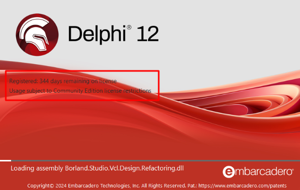
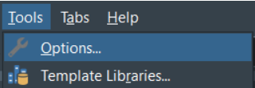
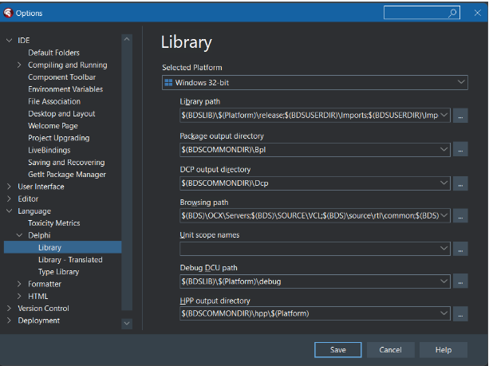
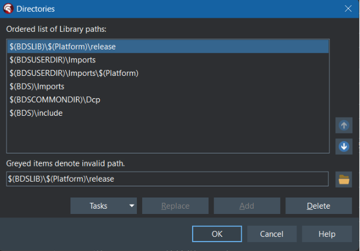
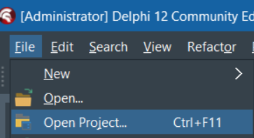

 

## Instalação
Os fontes do projeto ficam hospedados do github. Para fazer o download dos arquivos, você precisa de um cliente git. Utilize um de sua preferência e siga para o próximo passo.

## Download do projeto
https://github.com/fortesinformatica/fortesreport-ce.git

## Preparando o ambiente
Após realizar o download dos fontes do projeto, o próximo passo é começar a realizar a instalação do pacote.

## Atenção
Para fins didáticos, estou realizando a instalação na versão Community Edition do Delphi 12 (Codinome Athenas). 
Mas você pode reproduzir os mesmos passos em outras versões, pois o princípio da instalação manual será a mesma.

## Ajustando os paths
A primeira etapa consiste em ajustar o path de onde o Delphi irá buscar pelos arquivos no momento da instalação. 
Navegue até a opção: Tools > Options.
 

Será aberta a janela de opções. Navegue até a opção: Language > Delphi > Library.

Do lado direito será exibida algumas informações. Vou manter a plataforma de 32bit, mas você pode realizar a instalação em 64bit também se assim preferir. 
Clique no botão em frente ao campo Library path. 

Será aberta a janela com os paths que o Delphi utiliza.

Na janela acima, vamos definir a localização dos fontes do projeto ACBr. Clique no botão que fica em frente ao campo **Greyed items denote invalid path.** 
Será aberta uma janela para você informar o local que deseja adicionar para essa lista de path. Navegue até o local onde você fez o download do projeto e 
adicione os diretórios abaixo:

| Local | Diretório |
| --- | --- |
| fortesreport-ce-master\\Source | Source |

## Compilando e instalando os pacotes

Agora que temos os paths ajustados, vamos começar a compilar os pacotes. 

Navegue até a opção: File > Open Project

Navegue até o diretório onde você fez o download dos fontes do projeto. Iremos iniciar a compilação dos pacotes.

Siga a ordem abaixo.

| Sequência | Local | Pacote | Compilar | Instalar |
| --- | --- | --- | --- | --- |
| 1   | \\fortesreport-ce-master\\Packages\\ | frce.dpk | Sim | Não |
| 2   | \\fortesreport-ce-master\\Packages\\ | dclfrce.dpk | Sim | Sim |

Concluído a compilação e a instalação dos pacotes, feche o Delphi. Caso seja exibida uma mensagem questionando se deseja salvar as alterações do arquivo dclfrce, basta clicar
em não e sair da IDE.

Abra o Delphi novamente e observe que agora na tela de splashscreen é exibido os dados do componente fortesreportce.

Pronto! Agora você já pode começar a criar seus relatórios utilizando o fortes report.

